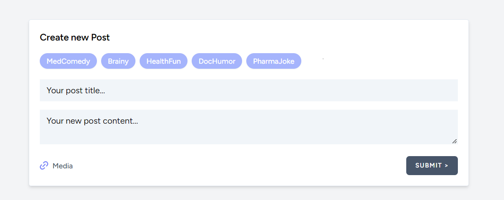

# Laravel 10 Blog System



## Introduction

This project is a simple blog system built using Laravel 10. It features user registration and authentication, CRUD operations for blog posts, comments and a search function. The application leverages Laravel's MVC architecture, Eloquent ORM, Blade templating, and Tailwind CSS.

## Features

-   **User Registration/Authentication**: Users can register and log in.
-   **CRUD Operations**: Users can create, read, update, and delete blog posts.
-   **Comments**: Authenticated users can comment on posts and edit their own comments.
-   **Categories**: Posts can be categorized, implementing a many-to-many relationship.
-   **Search Function**: Users can search blog posts by title and body content.
-   **Security**: Input validation, Middleware for access control, and XSS protection.

## System Requirements

-   PHP >= 8.0
-   MySQL or another compatible database system
-   Composer
-   Node.js and NPM (for compiling assets using Vite)

## Installation

1. **Clone the Repository**

    ```
    git clone https://github.com/shternberga/laravel10-blog.git
    cd laravel10-blog
    ```

2. **Install Dependencies**

    ```
    composer install
    npm install
    npm run build
    ```

3. **Environment Setup**

    - Copy the `.env.example` file to a new `.env` file:
        ```
        cp .env.example .env
        ```
    - Configure your `.env` file with your database credentials.

4. **Generate Application Key**

    ```
    php artisan key:generate
    ```

5. **Run Migrations and Seed Database**

    ```
    php artisan migrate --seed
    ```

6. **Run the Application**
    ```
    php artisan serve
    ```
    Access the application via `http://localhost:8000` in your web browser.

## Usage

-   **Registration and Login**: Access the registration and login pages from the homepage to create a new user account or log in to an existing one.
-   **Creating Posts**: Once logged in, navigate to the dashboard to create and manage blog posts.
-   **Commenting**: View any blog post and submit comments at the bottom of the post page.
-   **Searching and Categorization**: Use the search bar to find posts or browse posts by category.
